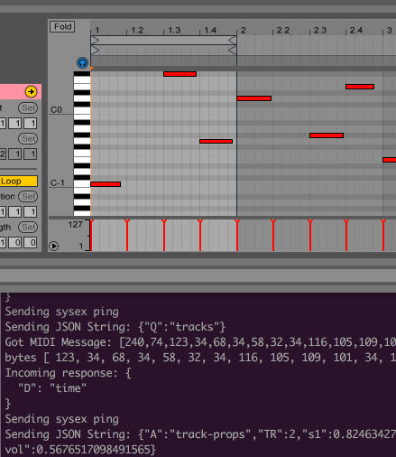

# Ableton Live Bridge

Manipulate your liveset from the outside from any language.




## Disclaimer

This is a hacky work in progress, not finished in any way...


## Background

[Ableton Live](https://www.ableton.com/en/live/) is great, and it rarely crashes, having that as something that backs your' audio based installations is perfect, the problem is that just sending MIDI notes into it in realtime is not always optimal, and means that your external application needs to be able to keep up with the tempo in Live, which might be difficult if it's doing lot's of other things.

This is a small hack to be able to manipulate an Abelton Live liveset from outside the app, my usecases for this is that i want to use [my custom hardware](https://www.youtube.com/watch?v=plqFOPkOJd4) to edit patterns inside of Live, just like the [Push](https://www.ableton.com/en/push/) does, and that i wan't to use Live as the player but control it from external events, such as [Bluetooth sensors](https://github.com/possan/sensortag-midi) etc.

Since the MIDI Remote Scripts are written in Python, it seems fairly easy, but the documentation is sparse except for the work by [Julien Bayle](http://julienbayle.net/ableton-live-9-midi-remote-scripts/), [decompyled files from the bundled scripts](https://github.com/gluon/AbletonLive9_RemoteScripts) and a few [blogposts by Keith McMillen](https://www.keithmcmillen.com/blog/controlling-the-controllers-communicating-with-and-controlling-live-scripts-part-3/), and i'd like to control it from the outside.

I tried running a socket server inside the script, didn't work, so, i resorted to sending JSON data over Sysex, the protocol is described below.


## Run the hack

Install the MIDI Remote Script into Live (Only tested with 9.0 on OSX):

```
cd MIDIRemoteScript
make install9
```

Set up a couple of virtual MIDI ports in your OS, one for input into the controller and one for output


Set up the remote control in Ableton Live:


Start Ableton Live.

Set up the hacky script. `npm install`

Edit `SysexBridge/hack.js` and change the value of the `INPUT_NAME` and `OUTPUT_NAME` to point to the virtual midi input and output you use for the control in Live.

Run script `node hack.js`

Watch the first clip notes' change every now and again in Live.


## Debugging

Ableton Live writes a log file that can be tailed

`tail -f ~/Library/Preferences/Ableton/Live\ 9.6/Log.txt`


## TODO

* Cue/Trigger clips
* Manipulate automation curves
* Manipulate clip length / loop points
* Get position/bpm
* Much much more...


## Notes for the JSON over Sysex Protocol

Sysex is simple MIDI packets `0xF0 [any number of 7-bit data bytes] 0xF7`

First data byte:
`0x6A` `"j"` = JSON REQUEST
`0x4A` `"J"` = JSON RESPONSE

The rest, 7-bit JSON.


### Common JSON properties

Queries/responses
`Q` Name of data to query for.
`D` Name of data in response
`A` Action to perform (no response).

`SL` Slot number (row).
`TR` Track number (column).
`ST` Step number (column in clip).

Note objects:
`_` Note id
`N` Note number (C-3 = 36)
`V` Note velocity
`D` Note duration
`S` Note start (256 step per note, 16 notes per bar)


### JSON Request examples

Query for notes in a clip

```
{
    Q: "clip-notes",
    TR: 0 # First track (column)
    SL: 0 # First slot (row)
}
```

Get track properties

```
{
    Q: "track-props",
    TR: 0
}
```

Get time

```
{
    Q: "time"
}
```

Get all tracks' properties

```
{
    Q: "tracks",
}
```

Update track properties

```
{
    A: "track-props",
    TR: 0,
    vol: 127,
    send1: 127,
    send2: 127,
    solo: true,
    mute: false
}
```

Replace notes in a clip

```
{
    D: "clip-notes",
    TR: 0,
    SL: 2,
    notes: [
        { S: 0, N: 36, D: 1, V: 127 },
        { S: 1, N: 36, D: 1, V: 127 },
        { S: 2, N: 36, D: 1, V: 127 },
        { S: 3, N: 36, D: 1, V: 127 },
    ]
}
```


### JSON Response examples

Track property response

```
{
    D: "track-props",
    TR: 0,
    playing: -1,        # Currently playing slot
    cued: 0,            # Currently cued slot
    vol: 127,
    send1: 127,
    send2: 127,
    solo: true,
    mute: false,
}
```

Timing response

```
{
    D: "time",
    playing: false,
    bpm: 120,
    step: 4,
    time: 1.0,
}
```

All tracks' properties response

```
{
    D: "tracks",
    tracks: [
        {
            TR: 0,
            playing: -1,     # Currently playing slot
            cued: 0,         # Currently cued slot
            vol: 127,
            send1: 127,
            send2: 127,
            solo: true,
            mute: false,
        },
        ...
    ]
}
```

Slot property response

```
{
    D: "track-props",
    TR: 0,
    SL: 1,
    playing: false,        # Currently playing slot
    cued: true,            # Currently cued slot
    loop_start: 0,
    loop_length: 16,
}
```

After querying for notes in a clip

```
{
    D: "clip-notes",
    TR: 0,
    SL: 0,
    notes: [
        { i: 0, S: 0, N: 36, D: 1, V: 127 },
        { i: 1, S: 1, N: 36, D: 1, V: 127 },
        { i: 2, S: 2, N: 36, D: 1, V: 127 },
        { i: 3, S: 3, N: 36, D: 1, V: 127 },
    ]
}
```


